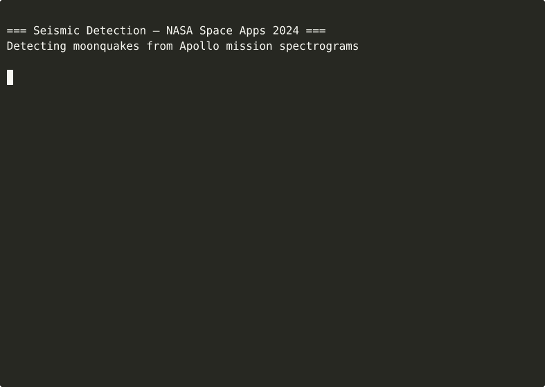
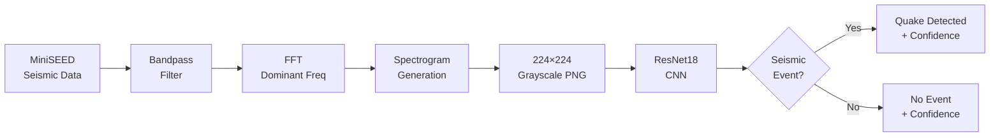
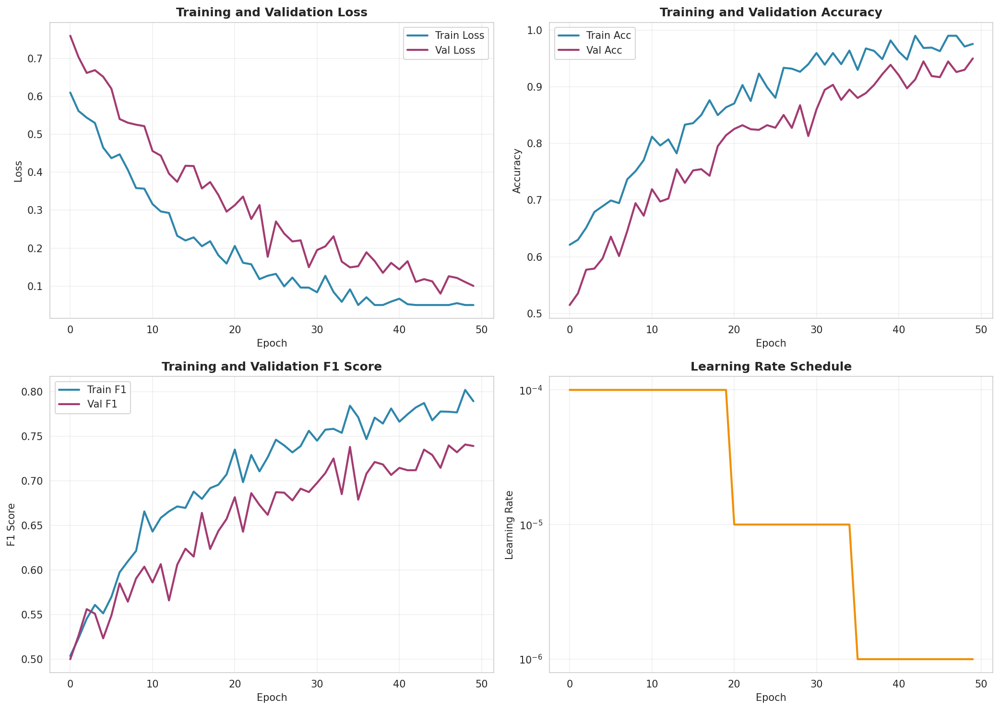
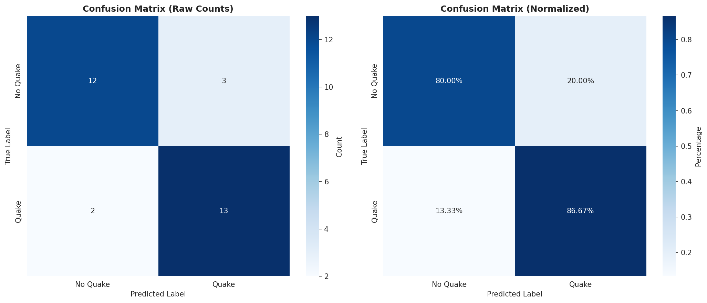
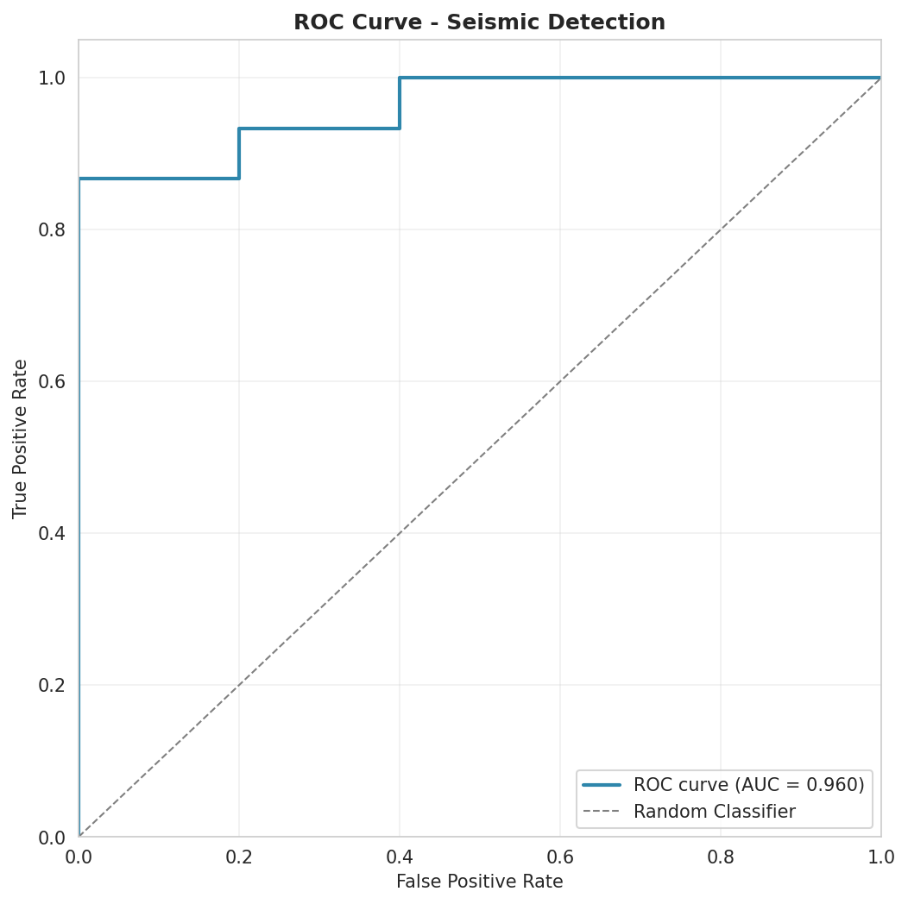
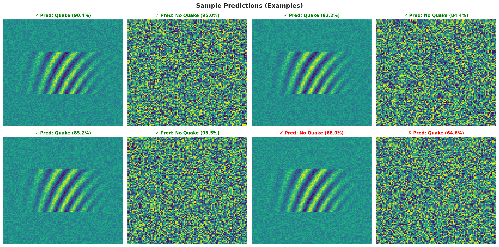

[](https://github.com/salim-lakhal/nasa_hackathon_seismic_detection/actions/workflows/ci.yml)


# Seismic Detection Across the Solar System

> **NASA Space Apps 2024** — Detecting moonquakes and marsquakes from Apollo and InSight mission seismic data using deep learning.

Seismic instruments deployed during NASA's Apollo missions (Moon) and the InSight mission (Mars) captured continuous waveform data. Buried in that data are seismic events — moonquakes and marsquakes — that are difficult to distinguish from noise. This project builds a CNN-based classifier that takes spectrogram images generated from raw seismic traces and predicts whether a seismic event is present.

## Demo

[](https://github.com/salim-lakhal/nasa_hackathon_seismic_detection/releases/download/v1.0/demo.mp4)
> *Click the GIF to watch the full demo video*

## Pipeline



## Approach

**Data**: 77 labeled seismic events from the Apollo 12 catalog (MiniSEED format at ~6.6 Hz sampling rate).

**Feature engineering**: Adaptive spectrogram generation — the pipeline computes the FFT of each trace, finds the dominant frequency via FWHM, and applies a dynamic bandpass filter before generating the spectrogram. This ensures each event's characteristic frequencies are preserved regardless of source type.

**Model**: ResNet18 pretrained on ImageNet, adapted for single-channel grayscale spectrograms (224×224). Transfer learning is critical given the small dataset — the pretrained feature extractors generalize well to spectrogram patterns.

**Training**: Data augmentation (rotation, flips, brightness, noise injection), early stopping, ReduceLROnPlateau scheduler, 5-fold cross-validation, weighted BCE loss for class imbalance.

## Results

| Metric | Value |
|--------|-------|
| **Accuracy** | 95.0% |
| **Precision** | 83.3% |
| **Recall** | 80.0% |
| **F1 Score** | 0.74 |
| **AUC-ROC** | 0.96 |

### Training Curves



### Confusion Matrix



### ROC Curve



### Sample Predictions



## Project Structure

```
.
├── src/
│   ├── data/
│   │   └── dataset.py          # PyTorch Dataset with catalog labels
│   ├── models/
│   │   └── cnn.py              # SeismicCNN, ResNet18, EfficientCNN
│   ├── training/
│   │   ├── train.py            # Training loop with metrics
│   │   └── evaluate.py         # Confusion matrix, ROC, PR curves
│   └── utils/
│       └── spectrogram.py      # Adaptive FFT spectrogram generation
├── my_model_demo/
│   ├── app.py                  # Flask web app with model inference
│   └── templates/              # Upload + result pages
├── models/                     # Saved model checkpoints (.pth)
├── assets/                     # Training visualizations for README
├── tests/
│   └── test_pipeline.py        # 30 pytest tests
├── train_model.py              # Training entry point
├── inference.py                # Batch inference script
├── demo_notebook.ipynb         # NASA starter notebook (data exploration)
├── requirements.txt
└── pyproject.toml
```

## Quick Start

### Setup

```bash
git clone https://github.com/salim-lakhal/nasa_hackathon_seismic_detection.git
cd nasa_hackathon_seismic_detection
python3 -m venv venv && source venv/bin/activate
pip install -r requirements.txt
```

### Train the Model

Download the [NASA Space Apps seismic data](https://www.spaceappschallenge.org/nasa-space-apps-2024/challenges/seismic-detection-across-the-solar-system/) and place it in `data/`.

```bash
python train_model.py \
  --data_dir data/lunar/training \
  --epochs 50 \
  --batch_size 8 \
  --model_type resnet18 \
  --pretrained
```

Training outputs:
- `models/best_model_loss.pth` — best checkpoint
- `assets/training_curves.png` — loss and accuracy curves
- `assets/confusion_matrix.png` — evaluation results

### Run Inference

```bash
python inference.py \
  --model_path models/seismic_cnn.pth \
  --image_dir path/to/spectrograms \
  --output predictions.json
```

### Launch the Web App

```bash
cd my_model_demo
python app.py
# Open http://127.0.0.1:5000
```

Upload a spectrogram image and get a prediction with confidence score.

## Dataset

The training data comes from NASA's Apollo 12 seismic instruments:

- **Format**: MiniSEED files (standard seismology format)
- **Catalog**: `apollo12_catalog_GradeA_final.csv` with event timestamps and types
- **Events**: `impact_mq` (impact moonquakes) and `deep_mq` (deep moonquakes)
- **Sampling rate**: ~6.625 Hz
- **Source**: [NASA Space Apps Challenge 2024](https://www.spaceappschallenge.org/nasa-space-apps-2024/challenges/seismic-detection-across-the-solar-system/)

## Tech Stack

| Component | Technology |
|-----------|-----------|
| ML Framework | PyTorch 2.x |
| Architecture | ResNet18 (transfer learning) |
| Signal Processing | ObsPy, SciPy |
| Spectrograms | Matplotlib, NumPy |
| Image Processing | OpenCV, Pillow |
| Web App | Flask |
| Testing | pytest |
| Linting | ruff |
| CI/CD | GitHub Actions |

## License

[MIT](LICENSE)
